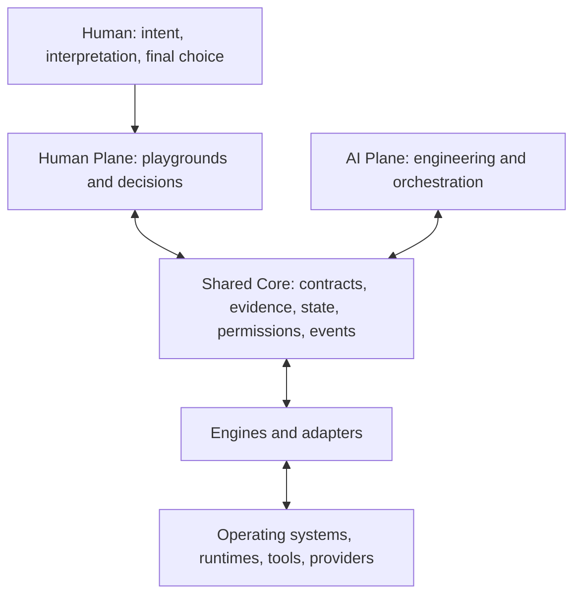

# Architecture

Status: **CONCEPT**. Genesis defines boundaries and responsibilities. No HAAEP core, engine, desktop, plugin loader, or integration is implemented.

> Build complexity for AI, but always return an understandable, explorable and controllable world to the human.

## Two planes, one shared reality

The [Human Plane](HUMAN_PLANE.md) presents meaning, explanations, experiments, comparisons, and controls. The [AI Plane](AI_PLANE.md) performs analysis, coding, simulation, tool execution, and verification. Both consume the same engine semantics. A graphical control must not invent its own version of an engineering rule, and an AI tool must not bypass a permission boundary because its caller is an agent.

The shared core is a proposed coordination boundary, not a commitment to a large framework or a particular programming language. Its eventual responsibilities are common contracts for facts and evidence, mission scope, action plans and permissions, state references, and lifecycle events. Technology-specific knowledge belongs in engines or adapters.

## Components and boundaries

| Component | Responsibility | Boundary |
| --- | --- | --- |
| Engine | Answer a coherent engineering question; observe, explain, propose, verify | Does not acquire ambient permission to modify the machine |
| Adapter | Translate one external system into an engine contract | Preserves source limitations and unknowns; does not claim untested platform support |
| Provider | Supply a replaceable service such as local inference | Advertises evidenced capabilities and data-handling constraints |
| Playground | Let a person observe, understand, experiment, compare, and choose | Consumes engine contracts; does not duplicate engine decisions |
| Pack | Group related engines, adapters, and human surfaces | Packaging and dependency declarations grant no authority |
| Agent | Plan or perform delegated work within a mission | Uses the same authorization and evidence boundaries as other callers |
| Experiment | Test one bounded architectural or engineering hypothesis | Clearly distinguishes synthetic evidence from live observations |

See the [engine contract](ENGINE_CONTRACT.md), [playground contract](PLAYGROUND_CONTRACT.md), and [pack model](ENGINE_PACKS.md).

## Proposed interaction

1. A mission records the human objective, scope, constraints, and verification expectations.
2. An engine observes within its allowed scope and produces facts linked to evidence.
3. The engine explains what those facts support, including uncertainty and unavailable capabilities.
4. If action is useful, it proposes a bounded plan with effects, risk, prerequisites, verification, and recovery limits.
5. The human surface or agent presents that same plan. An applicable grant authorizes only its stated scope. Consequential actions retain human choice.
6. The executor rechecks scope, authorization, and relevant preconditions before applying the plan.
7. Verification records an outcome. A failed or partial outcome may lead to a separate recovery decision; it does not disappear from history.
8. The human receives an explanation and a comparison of observed states, including what remains unknown.

Proposal, authorization, application, and verification are distinct events. A successful command exit is not sufficient proof that the intended objective was achieved.

## Planned integration boundaries

[CWRE](CWRE_RELATIONSHIP.md) remains an independent compatibility and recovery project. [ARX](ARX_RELATIONSHIP.md) is a proposed evidence and reconciliation integration. [Dragon-Hydra](DRAGON_HYDRA_RELATIONSHIP.md) is a proposed orchestration integration. HAAEP does not absorb or rename them during Genesis.

[Operating-system](OS_PLANE.md), [runtime](RUNTIME_PLANE.md), [GPU](GPU_COMPUTE.md), and [local AI](LOCAL_AI.md) directions join through bounded adapters, engines, or providers. A name in the roadmap is not a support claim. Windows is the first evidenced development context; each HAAEP adapter still needs its own implementation and tests.

The possible desktop surface includes projects, missions, engines, agents, evidence, system health, GPU and runtimes, playgrounds, state comparison, recovery, logs, and settings. These are navigation concepts, not implemented screens.

## Growth and open decisions

Build one real, bounded capability before choosing a general plugin system, transport protocol, database, or GUI framework. Contracts should first be pressure-tested with synthetic cases and then real evidence. Contract evolution must make compatibility limits explicit and must not silently reinterpret older state.

Open decisions include the first implementation language, process isolation model, storage format, contract versioning mechanism, and first human surface. The [decision log](DECISIONS.md) records accepted direction; [progress](PROGRESS.md) names the next bounded block. The [security model](SECURITY_MODEL.md) and [state/delta model](STATE_DELTA_MODEL.md) apply across every component.
