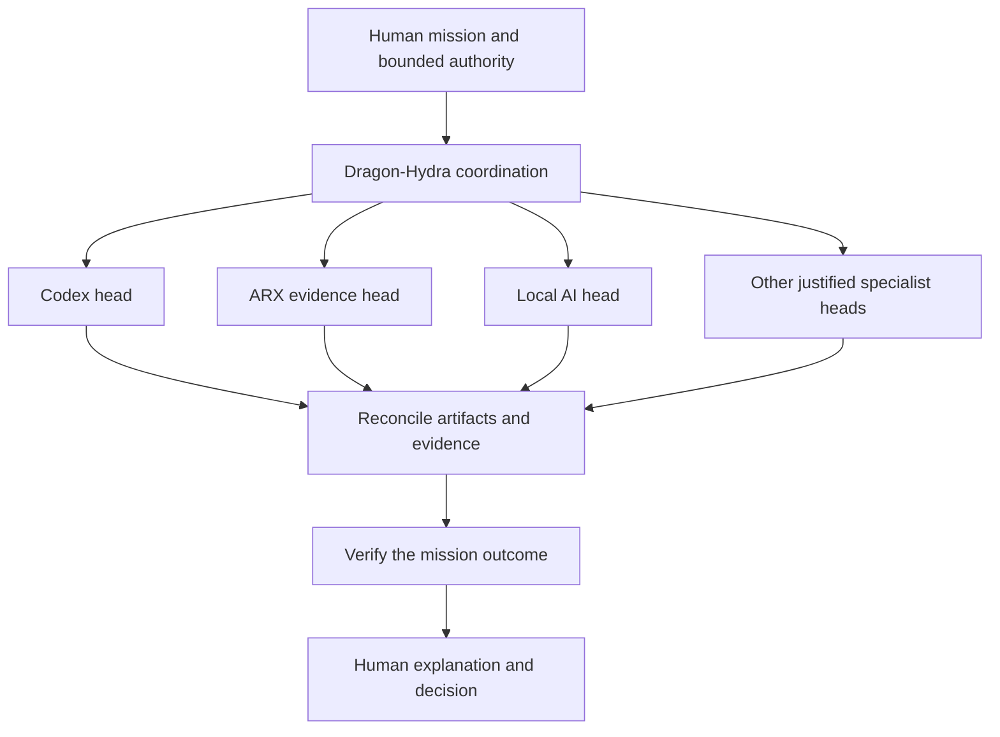

# Dragon-Hydra relationship

Status: **CONCEPT / RESEARCH DIRECTION**. No orchestrator, agent swarm, or integration is implemented in HAAEP.

Dragon-Hydra is the proposed multi-agent orchestration subsystem. HAAEP supplies mission intent, bounded authority, evidence requirements, and human decision surfaces. Dragon-Hydra could decompose authorized work, coordinate specialist agents, reconcile results, and return a verifiable outcome.

## Conceptual flow

Other possible heads include GPU, tests, documentation, and operating-system inspection. These names describe possible responsibilities; they do not justify creating agents without a real need.

## Required boundaries before execution

- Each delegated task needs a scope, expected artifact, acceptance criteria, resource budget, and cancellation path.
- Delegation may narrow authority; it must not manufacture or expand it. A child agent's request is not human approval.
- Parallel writers need isolated work areas or an explicit ownership protocol. Conflicts must be reconciled before results are accepted.
- Agent outputs, repository content, and tool responses are evidence to assess, not trusted authority to alter the mission.
- Consequential actions require the applicable permission decision at the execution boundary. A planning agent must not bypass that boundary by asking a different agent to perform the action.
- Cancellation must report in-flight work and completed effects. Stopping orchestration is not proof that every external operation was reversed.
- Time, cost, compute, retries, and fan-out need explicit bounds; failed tasks must not create unbounded retry loops.

## Result and verification model

An agent result should identify its task, relevant inputs, artifacts changed, evidence, checks performed, unresolved conflicts, and limitations. Agreement among agents is not sufficient proof. Verification must address the mission's acceptance criteria and should use independent evidence where the risk warrants it.

Reconciliation should preserve dissenting evidence and record why an artifact or interpretation was chosen. An unresolved conflict may return to the human rather than being silently hidden behind a single confident summary.

## Human face

A future mission playground should show task ownership, progress, resource consumption, pending decisions, changed artifacts, comparisons, and stop controls. The human should understand what each specialist is doing without reading every internal message. Relevant evidence and unresolved questions must remain inspectable.

The first integration should be a bounded experiment with a small number of agents and synthetic or isolated work. A production swarm, open-ended autonomy, and global machine authority are outside Genesis.

See [AI Plane](AI_PLANE.md), [security model](SECURITY_MODEL.md), [state and delta model](STATE_DELTA_MODEL.md), and [roadmap](ROADMAP_2_YEARS.md).
